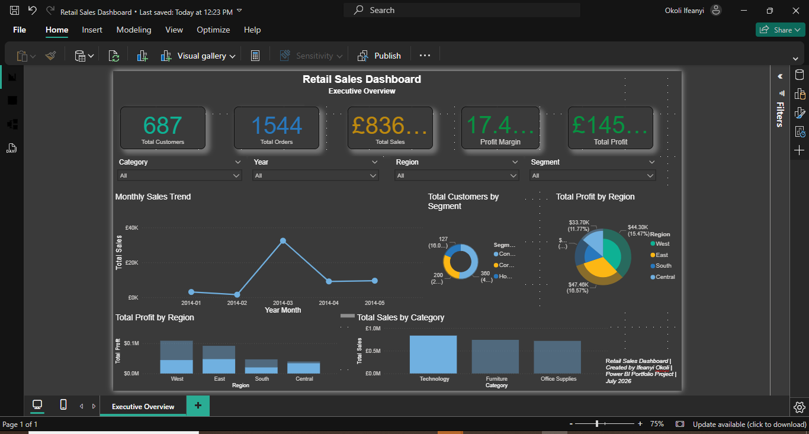
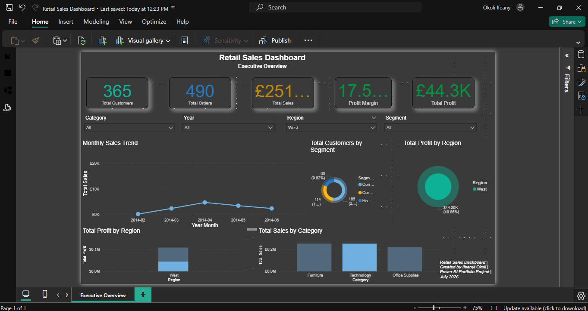
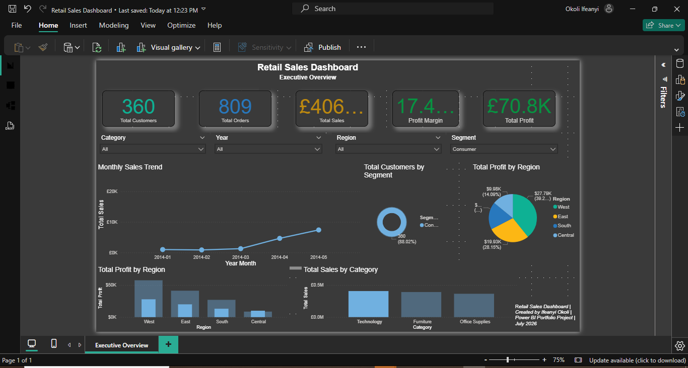

# retail-sales-dashboard-powerbi
Interactive Retail Sales Dashboard built with Microsoft Power BI

Retail Sales Dashboard
Project Overview
This project is an interactive Retail Sales Dashboard built in Microsoft Power BI using the Sample Superstore dataset.
The dashboard provides executives with insights into sales performance, profitability, customer segments and regional trends.
________________________________________
## Dashboard Preview

## Regional Sales

## Customer Segment

________________________________________
**Business Problem**
Retail managers require an easy way to monitor sales performance across different regions, product categories and customer segments.
This dashboard provides an executive-level overview of key business metrics to support data-driven decision making.
________________________________________
**Dataset**
Source:
Sample Superstore Dataset
Contains approximately:
•	9,994 Orders 
•	793 Customers 
•	Multiple Product Categories 
•	Regional Sales 
•	Profit Information 
•	Order Dates 
________________________________________
**Features**
✔ Executive KPI Cards
•	Total Sales 
•	Total Profit 
•	Profit Margin 
•	Total Orders 
•	Total Customers 
✔ Interactive Slicers
•	Category 
•	Region 
•	Segment 
•	Year 
✔ Visualizations
•	Monthly Sales Trend 
•	Sales by Category 
•	Profit by Region 
•	Customer Distribution by Segment 
________________________________________
**Data Preparation**
Data cleaning was completed using Power Query.
Tasks performed included:
•	Corrected US date formatting using Locale 
•	Converted Sales and Profit to numeric values 
•	Built Calendar table 
•	Created Date hierarchy 
•	Removed data type inconsistencies 
________________________________________
**Data Model**
Fact Table
•	Sales 
Dimension Table
•	Calendar 
Relationship
Calendar[Date]
       │
       │
       ▼
Sales[Order Date]
________________________________________
**DAX Measures**
Examples include:
Total Sales =
SUM(sales[Sales])

Total Profit =
SUM(sales[Profit])

Profit Margin =
DIVIDE([Total Profit],[Total Sales])

Total Orders =
DISTINCTCOUNT(sales[Order ID])

Total Customers =
DISTINCTCOUNT(sales[Customer ID])
________________________________________
## Skills Demonstrated

- Power BI
- Power Query
- Data Cleaning
- Data Modeling
- DAX Measures
- Interactive Dashboards
- KPI Reporting
- Slicers & Filters
- Time Intelligence
- Data Visualization

___________________________________________
## Key Insights

- Generated over £2.3M in total sales.
- Technology was the highest-selling category.
- The West region generated the highest profit.
- Profit margin remained above 12%.
- Interactive filters allow users to analyze performance by year, region, category and customer segment.
________________________________________
Dashboard

 ___________________________
Author
Ifeanyi Okoli
LinkedIn: https://www.linkedin.com/in/ifeanyi-okoli-580b216a/
GitHub: https://github.com/Ifeanyi-Okoli

